# Data Pipeline Architecture

This document outlines the data pipeline architecture for processing organization data, generating document embeddings, and storing these embeddings in an index for fast retrieval. The pipeline follows a sequential data flow as described below:

1. **File Path**  
   The pipeline begins by reading raw data from a specified file path.

2. **Information Extraction via Regular Expression**  
   A regular expression is applied to the raw file content to extract relevant information (e.g., document ID, title, and description) based on a defined pattern.

3. **Document Conversion and Chunking**  
   - The extracted text is converted into structured documents.
   - For larger text blocks, the text is split into smaller, manageable chunks to preserve semantic context while ensuring processing efficiency.

4. **Embedding Generation**  
   The resulting documents or document chunks are fed into an embedding function that leverages a pre-trained SentenceTransformer model to create vector embeddings.

5. **Indexing**  
   Finally, the generated embeddings are saved into a FAISS index, allowing for efficient similarity searches and fast retrieval during inference.

---

# Data Pipeline Architecture

This section outlines the sequential data flow in our pipeline for processing organization data. The pipeline efficiently handles raw inputs by extracting data, processing documents, creating embeddings with a SentenceTransformer, and saving these embeddings in a FAISS index for fast retrieval.

Below is the data flow diagram representing this pipeline:

```mermaid
flowchart TD
    A[Raw Data File Path] --> B[Regular Expression Extraction]
    B --> C[Convert Text to Documents]
    C --> D{Large Document?}
    D -- Yes --> E[Split into Chunks]
    D -- No --> F[Retain as Documents]
    E --> G[Embedding Function]
    F --> G[Embedding Function]
    G --> H[Save Embeddings to FAISS Index]
```

This diagram visually demonstrates the following steps:
- **Raw Data File Path:** The pipeline begins by reading the raw data from a specified file.
- **Regular Expression Extraction:** A regular expression extracts valuable information (e.g., document IDs, titles, descriptions).
- **Document Conversion and Chunking:**  
  - If a document is large, it is split into smaller, manageable chunks.
  - Otherwise, it is processed as a whole.
- **Embedding Generation:** Documents or chunks are then encoded into vector embeddings.
- **Indexing:** Finally, the embeddings are saved into a FAISS index to support efficient similarity search during retrieval.

This scalable and efficient architecture is designed for robust document ingestion, embedding, and retrieval in production-level deployments.